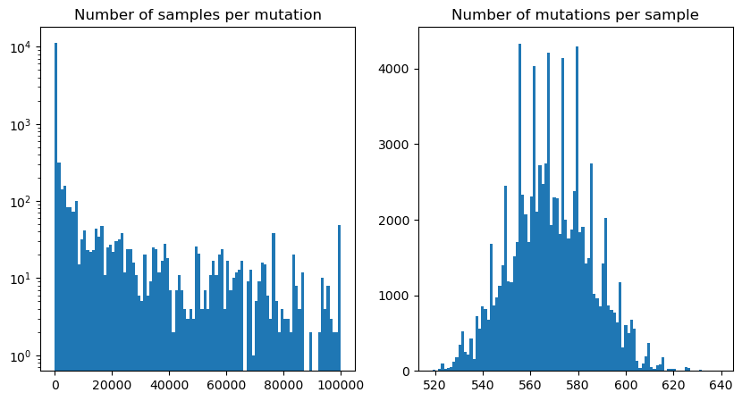

Broadly, our goal is to make GRG construction faster, ideally by using shared-memory parallelism to accelerate the comparatively slow BuildShape and MapMutations steps, and ideally in a way that's clever enough to warrant writing a paper about what we've done.
## State of the codebase
As currently implemented, `grgl`'s GRG construction factors the 4 sections of the algorithm into 4 independent executables, and runs them sequentially. Parallelism is achieved by running these intermediate steps piecemeal on contiguous sections of the genome, and merging the constituent GRGs at the end.
This approach makes a lot of sense:
- Because highly correlated mutations are close together, mutations which occur in the same or similar sets of samples will end up in the same intermediate GRG, preventing GRG construction over a region of the genome from being substantively more work than the full-genome case.
- Similarly, this is functionally a heuristic for reducing the number of mutations compared against for deduplication, as the farther away you get from the location of a given SNP, the less likely it is another mutation will cover the same samples.
For distributed parallelism, chunking the genome like this and merging the resulting GRGs is elegant and scales well. 
## What hasn't worked
### Reducing overhead from handoffs between executables
It seems natural to assume the code would be faster if the intermediate output from each part of the construction didn't have to be written to and read from disk between steps. However, when measured, I/O is negligible (<1% of runtime for the profile I ran), which is much less significant than the convenience the current setup affords.
### Parallelizing MapMutations
MapMutations associates each SNP with the node in the dendrogram created by BuildShape which covers all the samples with that SNP, or if no such node exists, adds one. This means that when parallelizing across SNPs, the edits made by two SNPs are independent **whenever they don't share any samples**, because the subtrees relevant to each SNP are independent.
We want to parallelize across SNPs, and ideally leverage this independence. This led to the first attempt at parallelization, constructing batches of SNPs which could be handled concurrently because their sample sets were independent of each other. This is attractive because:
- It's lock-free
- SNP popularity is power-law distributed, but the number of SNPs associated with each sample is roughly normally distributed, such that there wouldn't be undue contention over popular samples 
- *Supposing you can construct these sets of independent samples*, implementing such an approach would be (in principle) straightforward
Unfortunately, it turns out that this is an instance of *exclusive resource scheduling*, which is known to be NP hard. Even finding heuristically usable sets of independent samples is difficult. In the provided dataset, a mutation shares at least one sample with 12% of the other SNPs on average, and even if you restrict to the rarest 50% of SNPs (which are also the fastest SNPs to map), sets of the size we would want to saturate the processors on a typical node (100+) have collisions 62% of the time. As the size of the dataset increases, these trends are increasingly inconvenient.
Naturally, a more deliberate heuristic for selecting groups of independent samples would be valuable, but when evaluating on runtime against the existing baseline, I couldn't build anything fast enough that would-be savings from shared memory were larger than the time spent making batches of jobs.
One aspect of this project that made it considerably harder to debug was the topological ordering maintained by the GRG representation. I'm not sure I ever managed to properly make parallel accesses to the topological order of nodes, which is how new nodes/mutations are added to the GRG. The root of the problem is that within the logic of the datastructure, mutations which do not overlap in samples should have no common children, and should therefore be logically independent. However, because the topological order is (reasonably) stored as a vector instead of a linked list, inserting new nodes requires changes to the indices of the succeeding nodes, and this messes with the other processes operating on the list in a way that can't be solved easily even with locking. This was the biggest issue I encountered by far, and the degree to which my hacking to try and get around this issue threw a wrench in things makes my code more or less useless. My changes in this area are so bad that I cannot even find the last commit where it worked, and suspect that when it did work I may have broken it again without committing. It would have been much wiser to realize I had painted myself into a corner and start again from scratch with something more principled instead of spending a truly embarrassing amount of time trying to fix this. Lesson learned.
## Future directions
Drew has suggested a different approach to parallelizing MapMutations that I think addresses the things that made my efforts so doomed.
>1. The initial parallel portion is read-only. It only traverses the graph as we do now.
>2. Each graph modification is simply the addition of a node or the re-use of an existing node. Regardless, a mapped mutation can be represented as a list of children nodes `[a, b, c, ...]` and in the case of re-use of an existing node it will be a singleton list `[a]`
>3. During traversal, we capture all of these mapped results in a list. So our list might be `[ {mut1: [a, b, c]}, {mut2: [a, c]}, {mut3: [b, d, f]}, ...]`
>4. Sort this list by mutation (to replicate the non-thread-parallel version, which does mutation in order). In future we would explore other sortings.
>5. Apply each mapped result in series, e.g. creating a new node for `[a, b, c]` and assigning `mut1` to it.

This solves the quagmire of parallel updates to the graph, and focuses on parallelizing the aspects that are heavily computational.
### BWT-esque GRG construction
There has been some discussion of transitioning to a more linear-traversal based GRG construction algorithm resembling a BWT.
### Making GRGs more ARG-like
Empirically, de novo GRGs, while in principle similar to ARGs, are structurally very different. They're much deeper, and do not consistently capture the genealogical information ARGs are meant to represent.
### Shifting focus to conserving memory
While working on this, I was mainly concerned with trying to improve the runtime, which given the existing parallelism in the codebase, was both ambitious and low leverage. Future work should focus instead on trying to reduce the memory footprint without undue speed penalties. This is downstream of the fact that GRGL is not actually meant to run on machines like Perlmutter with high-memory nodes, but instead on cheaper cloud hardware. 
